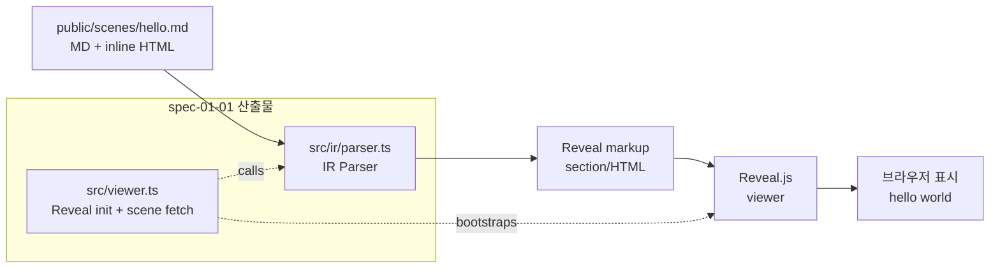

# spec-01-01: IR + 렌더 엔진 결정 + 최소 viewer 부트스트랩

## 📋 메타

| 항목 | 값 |
|---|---|
| **Spec ID** | `spec-01-01` |
| **Phase** | `phase-01` |
| **Branch** | `spec-01-01-bootstrap-viewer` |
| **상태** | Planning |
| **타입** | Feature (+ Chore for residual cleanup) |
| **Integration Test Required** | no (phase 시나리오 1 의 *수동* 검증으로 충분 — 자동화는 phase-level) |
| **작성일** | 2026-05-10 |
| **소유자** | dennis |

## 📋 배경 및 문제 정의

### 현재 상황

- `phase-01` (Scene Engine) 이 활성화되어 있고, 본 spec 이 첫 spec.
- 비전 문서 (`docs/planning.md`) Open Questions §5.2~§5.3 에서 미결로 둔 두 결정 — *Scene IR 형식* 과 *렌더 엔진* — 이 사용자와 합의됨:
  - **IR**: Markdown + inline HTML
  - **Render**: Reveal.js 위에 얹기 (필요 시 점진적으로 Reveal 플러그인 형태로 이주)
- `spec-x-rebrand-vision` 머지 후 main 워킹트리에 잔재가 떠 있음:
  - `backlog/queue.md` (sdd 가 직접 만든 dashboard)
  - `backlog/phase-01.md` (`sdd phase new` 결과)
  - `.gitignore`, `CLAUDE.md`, `.claude/` (harness-kit 부트스트랩 산출물)
  - `specs/spec-01-01-bootstrap-viewer/` (본 spec 의 메타 산출물)
- 코드는 0줄. `package.json` 도 없음.

### 문제점

1. **두 결정이 코드와 함께 구현되어야 가치가 굳음**: ADR 만 적고 코드가 없으면 "결정한 척" 에 그침. 실제 viewer 동작으로 검증해야 phase-2 이상이 안전하게 그 위에 올라설 수 있음.
2. **IR 파서가 없으면 IR 결정이 vacuous**: "MD + inline HTML" 이 실제로 Reveal markup 으로 잘 변환되는지 한 번도 확인되지 않은 상태로 phase 가 굴러가면, spec-1-03/04 에서 무너질 위험.
3. **잔재가 다음 spec 까지 끌고 가면 매번 noise**: 첫 spec 에서 한 번에 정리해야 이후가 깨끗함.
4. **빌드 / 패키지 매니저 / 언어 스택 미정**: 본 spec 에서 정해야 phase-1 의 모든 후속 spec 이 동일 stack 위에서 진행 가능.

### 해결 방안 (요약)

본 spec 에서 다음 6 가지를 한 번에 처리한다:

1. ADR-001 (Scene IR), ADR-002 (Render Engine) 작성 — 결정과 trade-off 를 영구 기록.
2. 프로젝트 부트스트랩 — `package.json` + Vite + TypeScript + Reveal.js + Vitest.
3. 최소 IR 파서 (TDD) — MD + inline HTML → Reveal markup.
4. 최소 viewer — `public/scenes/hello.md` 1장이 브라우저에 표시.
5. 잔재 정리 — 위 untracked 파일들을 첫 task 의 chore commit 으로 묶음.
6. phase 시나리오 1 의 *수동* PASS — "단일 scene 표시" 통과.

## 📊 개념도



## 🎯 요구사항

### Functional Requirements

1. **ADR-001 — Scene IR**:
   - 결정: **Markdown + inline HTML**
   - 대안 (HTML/MDX, DSL, MD only) 의 trade-off 표
   - 영향 범위 (이 IR 이 phase-2 Event Log / phase-3 자막 sync 에 어떻게 영향)
   - 위치: `docs/decisions/ADR-001-scene-ir.md`
2. **ADR-002 — Render Engine**:
   - 결정: **Reveal.js 위에 얹기** (Phase 2 에서 Event Log 후킹이 어색해지면 Reveal 플러그인 형태로 점진 이주)
   - 대안 (자체 구현, Remotion) 의 trade-off 표
   - 위치: `docs/decisions/ADR-002-render-engine.md`
3. **프로젝트 부트스트랩**:
   - `package.json` (npm 사용. type: "module")
   - 의존성: `reveal.js`, `vite`, `typescript`, `vitest`, `@types/node` 정도
   - `vite.config.ts`, `tsconfig.json` (strict mode)
   - `npm run dev` / `npm run build` / `npm run test` 동작
4. **디렉토리 구조 (확정)**:
   ```
   public/
     scenes/
       hello.md          # IR (MD + inline HTML)
   src/
     index.html          # Vite entry HTML
     viewer.ts           # 진입점 (scene 로드 → parser → Reveal init)
     ir/
       parser.ts         # IR → Reveal markup 변환
   test/
     ir.parser.test.ts
   docs/decisions/
     ADR-001-scene-ir.md
     ADR-002-render-engine.md
   ```
5. **IR 파서 (TDD)**:
   - 입력: MD + inline HTML 문자열
   - 출력: Reveal `<section>` 단위 markup (단일 scene 의 경우 한 section)
   - 케이스 (단위 테스트 ≥3):
     - 단순 헤더 + 본문 (`# 제목\n\n내용`) → `<section><h1>제목</h1><p>내용</p></section>`
     - inline HTML 보존 (`<div class="grid">…</div>` 그대로)
     - frontmatter (`---\ntitle: foo\n---`) → 메타 추출 + 본문 markup
   - 라이브러리: `markdown-it` (가벼운, frontmatter 플러그인 분리 가능). frontmatter 는 직접 분리해도 OK.
6. **최소 viewer**:
   - `viewer.ts`: `fetch('/scenes/hello.md')` → parser → `Reveal.initialize({ slides: [...] })` 또는 DOM 삽입 후 init
   - `npm run dev` → `http://localhost:5173` → hello scene 이 풀 화면에 표시
7. **잔재 정리 (chore)**:
   - 첫 task 한 commit 에서 다음을 모두 add:
     - `backlog/queue.md`, `backlog/phase-01.md`
     - `.gitignore`, `CLAUDE.md`, `.claude/settings.json`, `.claude/commands/` (단, `.claude/state/` 는 .gitignore 에 의해 자동 제외)
     - `specs/spec-01-01-bootstrap-viewer/{spec,plan,task,walkthrough}.md` (이 4개)

### Non-Functional Requirements

1. **의존성 최소**: 의도적으로 위 6개 (`reveal.js`, `vite`, `typescript`, `vitest`, `@types/node`, `markdown-it`) 까지만. 추가 도입은 후속 spec 에서.
2. **TypeScript strict mode**: `strict: true`, `noImplicitAny`, `strictNullChecks` 등 모두 ON.
3. **포맷터**: 본 spec 에서는 Prettier / ESLint 도입 *연기* (필요해지는 시점에 별도 spec 또는 spec-01-04 즈음). 의도적으로 가볍게 시작.
4. **산출물 한국어**: spec/plan/task/walkthrough/pr_description/ADR 모두 한국어 (코드 식별자 / 파일 경로 / 주석은 영어 OK).
5. **Reveal.js 종속을 viewer 1 곳에 격리**: `src/viewer.ts` 만 Reveal API 를 알도록. `src/ir/parser.ts` 는 Reveal 비종속 (Reveal markup 형태의 *문자열* 만 출력). → 이주 시 영향 범위 최소화.

## 🚫 Out of Scope

- **키보드 / 풀스크린 네비게이션** — `spec-01-02` 에서.
- **CSS 애니메이션 / fragment** — `spec-01-03` 에서. (Reveal 자체는 일부 기본 동작 가능하지만, scene-flow 의 IR 매핑은 spec-01-03 의 일.)
- **PDF 출력 (`@media print`)** — `spec-01-04` 에서.
- **Markdown 파서 고도화** — 본 spec 의 `markdown-it` 위 최소 기능 외 추가는 `spec-01-05` 또는 후속 phase.
- **E2E (Playwright) 자동 테스트** — 본 spec 은 *수동* 검증으로 시나리오 1 통과 인정. 자동화는 phase-level 통합 테스트에서.
- **scene-flow 만의 Event Log / 메타 후킹** — phase-2 의 일. 단, viewer 의 Reveal init 코드에 *후킹 포인트만* 인터페이스로 남겨둠 (구현은 안 함).
- **테마 / 디자인 시스템** — 본 spec 은 Reveal 기본 테마 (`black` 또는 `white`) 그대로 사용.
- **Prettier / ESLint** — 의도적 연기.
- **CI / GitHub Actions** — 별도 spec 또는 phase.

## 🔍 Critique 결과

미실행. 사용자와 IR / 렌더 엔진 결정이 충분히 합의된 상태이고, 본 spec 은 그 결정을 코드로 굳히는 작업이라 critique 가치 제한적.

## ✅ Definition of Done

- [ ] **단위 테스트 PASS**: IR 파서 케이스 ≥3 (`vitest run`)
- [ ] **Phase 시나리오 1 수동 PASS**: `npm run dev` → 브라우저 → hello scene 이 풀 화면에 표시 (스크린샷을 walkthrough 에 첨부)
- [ ] **ADR-001 / ADR-002** 작성 및 commit 완료
- [ ] **잔재 정리 commit** 완료 (첫 task)
- [ ] **`walkthrough.md` / `pr_description.md` ship commit** 완료
- [ ] **`spec-01-01-bootstrap-viewer` 브랜치 push + PR 생성** 완료
- [ ] 사용자 검토 요청 알림 완료
