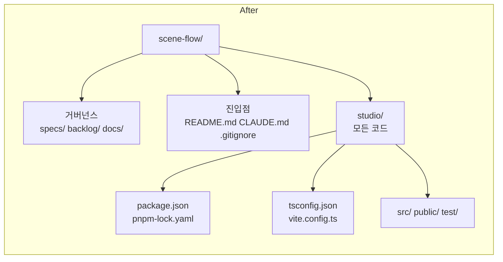

# Implementation Plan: spec-01-02

## 📋 Branch Strategy

- 신규 브랜치: `spec-01-02-restructure-after-bootstrap`
- 시작 지점: `main` (PR #2 머지 직후)
- 첫 task 가 브랜치 생성을 수행

## 🛑 사용자 검토 필요 (User Review Required)

> [!IMPORTANT]
> - [ ] **`studio/` 컨테이너로 모든 코드 이동** — 사용자 합의 (옵션 A)
> - [ ] **npm → pnpm 전환** — 사용자 명시 요청
> - [ ] **ADR-003 신설** — 저장소 구조 + 패키지 매니저 + 미래 React/Tailwind/shadcn/FSD/front.md 도입 정책 (자리만 명시, 지금 도입 안 함)
> - [ ] **dev 명령 표준 = `cd studio && pnpm run dev`** (옵션 a — root 에 thin wrapper 안 둠)
> - [ ] **git mv 사용** — rename 추적, blame / log 보존
> - [ ] **phase-01.md 본문 재배치** — 네비 → spec-01-03, 애니 → 04, PDF → 05, MD 파서 → 06 (선택)
> - [ ] **CI / shadcn / Tailwind / React / FSD / front.md 모두 *지금* 도입 안 함** — ADR-003 에 자리만 명시

> [!WARNING]
> - [ ] **pnpm 시스템 설치 또는 `corepack enable` 필요** — 사용자 환경에 pnpm 이 없으면 `npm i -g pnpm` 또는 corepack 으로 활성. 본 plan 은 corepack 우선 가정 (Node 20+ 표준 동봉).
> - [ ] **Reveal CSS import 경로 보존** — `studio/src/viewer.ts` 의 `import 'reveal.js/dist/reveal.css'` 는 `studio/node_modules/reveal.js/...` 를 가리키도록 자연스럽게 동작 (Vite 가 `studio/` root 기준으로 resolve). 별도 변경 불필요.
> - [ ] **Playwright 재검증 시 `node_modules/playwright`** 는 `studio/` 안에 *임시* 설치 (본 spec 에서도 `--no-save`). 검증 후 정리.

## 🎯 핵심 전략 (Core Strategy)

### 아키텍처 컨텍스트



### 주요 결정

| 컴포넌트 | 결정 | 이유 |
|:---:|:---|:---|
| **저장소 구조** | 거버넌스 / 진입점 / `studio/` 3 평면 | 최상위 깔끔, 향후 `runtime/` `recorder/` 추가 자연스러움. ADR-003. |
| **패키지 매니저** | pnpm (corepack 활성) | 빠름, disk efficient, monorepo 친화. 사용자 명시 결정. |
| **`studio/` 의 본질** | 현재는 *발표 viewer*, *미래의 React 편집기* 도 흡수 | 이름 자체가 양쪽 의미를 담음. 미래에 `runtime/` 분리 시 그 자리는 ADR 갱신으로. |
| **dev 명령 위치** | `cd studio && pnpm run dev` | 표준, 명확. root thin wrapper 는 multi-package 가 정말 필요해지면 도입. |
| **이동 방식** | `git mv` | git rename 추적 → blame / log 보존. |
| **React / Tailwind / shadcn / FSD / front.md** | 도입 안 함 (자리만 ADR-003 에 명시) | 오버엔지니어링 회피. 적정 시점 = phase-3/4 (studio 가 multi-feature GUI 가질 때). |
| **재검증** | Playwright 일회성 (이전 spec 과 동일 패턴) | 시나리오 1 *동일 동작* 보장. 새 스크린샷으로 증명. |

## 📂 Proposed Changes

### Task 1 — 브랜치 + ADR-003 작성

#### [NEW] `docs/decisions/ADR-003-repository-structure.md`

ADR 표준 양식. 핵심 결정:

- **저장소 구조**: 거버넌스 (specs/ backlog/ docs/) / 진입점 (README, CLAUDE, .gitignore) / `studio/` (코드)
- **패키지 매니저**: pnpm (corepack 우선)
- **studio 의 미래 흡수 범위**: 현재 vanilla TS + Reveal 위 + 미래 React/Tailwind/shadcn → studio 내부 점진 도입 (ADR-002 의 점진 이주 정책 연장)
- **FSD / front.md / monorepo 정식 분할**: 자리만 명시. 지금 도입 안 함.

거부된 대안:
- (a) src/ rename only (Studio 의미 손상 — 지금 코드는 runtime 본질이 아니어서 이름 충돌 회피 안 됨)
- (b) `packages/studio/` monorepo 정식 분할 (overengineering — 단일 패키지)
- (c) 지금 React + Tailwind + shadcn + FSD 도입 (오버엔지니어링 — phase-1 의 hello world 검증이 무거워짐)

### Task 2 — npm → pnpm 전환

#### [DELETE] `package-lock.json` (root)
- npm 산출물 — pnpm 으로 갈아탐.

#### [SHELL] `corepack enable && corepack prepare pnpm@latest --activate`
- 시스템에 pnpm 활성. 사용자 권한 / 환경 따라 `npm i -g pnpm` 대안.

### Task 3 — `studio/` 컨테이너 이동

#### [MOVE] `git mv` 일괄 이동
- `package.json` → `studio/package.json`
- `tsconfig.json` → `studio/tsconfig.json`
- `vite.config.ts` → `studio/vite.config.ts`
- `src/` (디렉토리) → `studio/src/`
- `public/` → `studio/public/`
- `test/` → `studio/test/`
- `dist/` 가 있으면 삭제 (gitignored, 재빌드 가능)

#### [MODIFY] `studio/vite.config.ts`

기존 `vite.config.ts` 가 `__dirname` (root 기준) 으로 경로 계산 — `studio/` 안으로 옮기면 `__dirname` 가 자동으로 `studio/` 가 되므로 *상대 경로 그대로 OK*. 단 명시적으로 점검:

```ts
// studio/vite.config.ts (이동 후)
import { defineConfig } from 'vite';
import { resolve } from 'node:path';

export default defineConfig({
  root: resolve(__dirname, 'src'),         // studio/src/
  publicDir: resolve(__dirname, 'public'), // studio/public/
  build: {
    outDir: resolve(__dirname, 'dist'),    // studio/dist/
    emptyOutDir: true,
  },
  server: { port: 5173, open: false },
  test: {
    root: resolve(__dirname),              // studio/
    include: ['test/**/*.test.ts'],
    environment: 'node',
    globals: true,
  },
});
```

#### [MODIFY] `studio/tsconfig.json`
- `include` 경로 점검. 기존 `["src/**/*", "test/**/*", "vite.config.ts"]` 는 `studio/` 기준으로 자동 동작.

#### [MODIFY] `studio/package.json` (필요 시)
- `name`, `scripts` 그대로 유지. pnpm 사용을 명시하기 위해 `"packageManager": "pnpm@<version>"` 필드 추가.

### Task 4 — pnpm install + 빌드 / 테스트 / dev 검증

#### [SHELL]
```bash
cd studio
pnpm install                  # pnpm-lock.yaml 생성
pnpm run build                # tsc + vite build PASS
pnpm run test                 # Vitest 3/3 PASS
pnpm run dev                  # 백그라운드 → curl 200 확인 → 정지
```

### Task 5 — Playwright 재검증

#### [SHELL] (이전 spec 과 동일 패턴)
```bash
cd studio
pnpm install --no-save playwright
pnpm exec playwright install chromium
node ./.verify-hello.mjs       # 7/7 PASS
# 검증 후 .verify-hello.mjs 삭제
```

#### [NEW] `specs/spec-01-02-restructure-after-bootstrap/screenshot-hello-after.png`
- 같은 시나리오 1 의 새 스크린샷. 이전 (`spec-01-01-bootstrap-viewer/screenshot-hello.png`) 와 *동일 결과* 일 것. reorg 후에도 동작 보존을 시각 증명.

### Task 6 — phase-01.md 본문 재배치

#### [MODIFY] `backlog/phase-01.md`
- 본문 (sdd 마커 외) 의 spec-01-02 ~ 05 서술을 재배치:
  - 기존 spec-01-02 (네비) → spec-01-03
  - 기존 spec-01-03 (애니) → spec-01-04
  - 기존 spec-01-04 (PDF) → spec-01-05
  - 기존 spec-01-05 선택 (MD 파서) → spec-01-06 선택
  - 새 spec-01-02 (본 spec) 항목 추가
- 위험 표 / Phase Done 조건 / 통합 테스트 시나리오 의 spec 참조도 갱신 (예: "연관 SPEC: spec-1-02, spec-1-03" → 새 번호로).
- sdd 자동 갱신 영역 (`<!-- sdd:specs:start --> ~ <!-- sdd:specs:end -->`) 은 *건드리지 않음* — sdd 가 자동.

### Task 7 — README / docs/planning 디렉토리 트리 갱신

#### [MODIFY] `README.md` (있다면)
- 현재 README 는 phase 비전 위주. 디렉토리 트리 섹션이 없을 가능성 큼 → 작은 *프로젝트 구조* 섹션 추가:
  ```
  ## 프로젝트 구조
  - studio/  — 코드 (Vite + TS + Reveal)
  - specs/   — 작업 로그
  - backlog/ — phase / queue
  - docs/    — ADR, planning
  ```

#### [MODIFY] `docs/planning.md`
- §2 Phase 정의 의 산출물 / 디렉토리 언급 부분 갱신. *모든 phase 의 코드는 studio/ 안* 임을 명시.

## 🧪 검증 계획 (Verification Plan)

### 단위 테스트

```bash
cd studio && pnpm run test
```

기대: 기존 3 케이스 PASS (변경 없음).

### 통합 테스트

해당 없음 (Integration Test Required = no). 시나리오 1 의 *Playwright 헤드리스 재검증* 으로 갈음.

### 수동 검증 시나리오

1. **최상위 깔끔성**: `ls scene-flow/` 결과가 README + CLAUDE + .gitignore + studio/ + specs/ + backlog/ + docs/ + (gitignored 디렉토리들) 로 한눈에 들어오는가.
2. **dev 서버 동작**: `cd studio && pnpm run dev` → http://localhost:5173 (또는 fallback) → 200 + hello scene 표시.
3. **build PASS**: `cd studio && pnpm run build` → tsc 에러 0, vite build 성공.
4. **test PASS**: `cd studio && pnpm run test` → 3/3.
5. **Playwright 시나리오 1**: 7/7 PASS + 새 스크린샷이 이전과 *시각적으로 동일* (한글 + 그리드 보존).
6. **git mv 추적 확인**: `git log --follow studio/src/viewer.ts` 가 이전 commit (`d6347a4` 등) 까지 이어지는가.
7. **phase-01.md 정합성**: 본문의 spec 번호 (03/04/05/06) 가 sdd 자동 갱신 영역 (spec 표 — spec-01-01 / spec-01-02 만 표시) 과 충돌 없음.

## 🔁 Rollback Plan

- 본 spec 은 *파일 이동 + 도구 변경* 위주. 코드 로직 변경 거의 0.
- 문제 시 `git revert <merge commit>` 으로 즉시 원복 — `studio/` 가 다시 풀어져 root 평면으로 복귀.
- pnpm-lock 이 npm 환경에서 안 동작 시 `git revert` 후 `npm install` 로 복원.
- 데이터 / 외부 시스템 영향 없음.

## 📦 Deliverables 체크

- [ ] task.md 작성 (다음 단계)
- [ ] 사용자 Plan Accept 받음
- [ ] (실행 후) ADR-003 작성 완료
- [ ] (실행 후) 모든 코드 `studio/` 안
- [ ] (실행 후) `pnpm-lock.yaml` 생성, `package-lock.json` 삭제
- [ ] (실행 후) build / test / dev / Playwright 시나리오 1 모두 PASS
- [ ] (실행 후) phase-01.md 본문 재배치
- [ ] (실행 후) walkthrough / pr_description ship + push + PR
