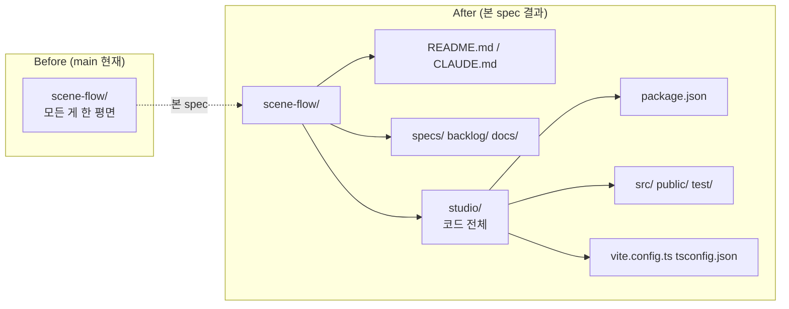

# spec-01-02: bootstrap 후속 — 저장소 구조 정리 (studio 컨테이너 + pnpm)

## 📋 메타

| 항목 | 값 |
|---|---|
| **Spec ID** | `spec-01-02` |
| **Phase** | `phase-01` |
| **Branch** | `spec-01-02-restructure-after-bootstrap` |
| **상태** | Planning |
| **타입** | Refactor (+ Chore + Docs) |
| **Integration Test Required** | no (시나리오 1 의 *수동* 재검증으로 갈음) |
| **작성일** | 2026-05-10 |
| **소유자** | dennis |

## 📋 배경 및 문제 정의

### 현재 상황

`spec-01-01-bootstrap-viewer` (PR #2) 머지 후 main 의 최상위 디렉토리에 *세 종류* 의 항목이 한 평면에 섞여 있다:

```
scene-flow/
├── package.json / tsconfig.json / vite.config.ts / src/ / public/ / test/   ← 코드
├── specs/ / backlog/ / docs/                                                ← 거버넌스
├── README.md / CLAUDE.md / .gitignore                                       ← 진입점
├── .claude/ / .harness-kit/ (ignored)                                       ← 인프라
└── node_modules/ / dist/ (ignored)                                          ← 산출물
```

코드와 거버넌스 / 진입점이 한 평면에 섞여 있어 GitHub 첫 화면이 어수선하다.

또한 PR #2 review 도중 사용자와 다음 결정이 합의됨:

- 패키지 매니저: **npm → pnpm**
- 코드 컨테이너: **`studio/`** 디렉토리로 묶음
- 미래 React 도입은 ADR-002 의 점진 이주 정책 연장 — *지금* React/Tailwind/shadcn/FSD/front.md 는 도입 안 함 (오버엔지니어링 회피, 적정 시점은 phase-3/4)
- 위 결정들을 영구 기록할 **ADR-003** 신설

### 문제점

1. **혼합된 최상위**: 첫 진입자가 *제품 코드* 와 *프로젝트 거버넌스* 를 분간하기 어려움. 향후 `runtime/` / `recorder/` 같은 모듈이 추가될 때 더 어수선해짐.
2. **npm 의 disk 비효율 / monorepo 친화 부족**: 향후 `studio/` 외에 별도 패키지가 들어올 가능성이 높은데 npm workspace 는 pnpm 보다 약함.
3. **미래 비전이 코드에 박혀 있지 않음**: "결국 React 로 발전" / "studio = 편집 환경" 결정이 ADR 에 없어 후속 spec 마다 같은 고민 반복.
4. **phase-01.md 본문이 옛 spec 분할 (spec-01-02 = 네비) 을 가짐**: 본 spec 이 02 자리에 들어가면서 네비 → 03 으로 밀려야 함.

### 해결 방안 (요약)

본 spec 한 PR 에서 다음을 함께 처리:

1. **ADR-003** 작성 — 저장소 구조 (`studio/` 컨테이너) + 패키지 매니저 (pnpm) + 미래 React/Tailwind/shadcn/FSD/front.md 도입 정책 (자리만 명시) + ADR-002 점진 이주와의 관계.
2. **npm → pnpm 전환** — `package-lock.json` 삭제, `pnpm-lock.yaml` 생성, `.gitignore` 정리.
3. **`studio/` 컨테이너 이동** — `package.json` / `tsconfig.json` / `vite.config.ts` / `src/` / `public/` / `test/` 모두 `studio/` 안으로. Vite root / TS include / dev 명령 경로 갱신.
4. **`phase-01.md` 본문 재배치** — spec-01-02 (구 네비) → 03, 03 (애니) → 04, 04 (PDF) → 05, 05 (MD 파서) → 06.
5. **README / docs/planning 디렉토리 트리 갱신**.
6. **재검증** — `cd studio && pnpm run dev` + `pnpm run build` + Playwright 헤드리스 시나리오 1 PASS + 새 스크린샷.

## 📊 개념도



## 🎯 요구사항

### Functional Requirements

1. **ADR-003 작성**: `docs/decisions/ADR-003-repository-structure.md`
   - Status / Context / Decision / Consequences / Alternatives 표준 양식
   - 핵심 결정 4가지:
     - 저장소 구조: 거버넌스 평면 (specs/ backlog/ docs/) + 진입점 (README, CLAUDE, .gitignore) + `studio/` 컨테이너 (모든 코드)
     - 패키지 매니저: pnpm
     - 미래 React 등 도입 시점 / 위치 (자리만 명시 — *지금 도입 안 함*)
     - ADR-002 의 점진 이주 정책과의 관계
   - 거부된 대안: monorepo `packages/`, src/ rename only, 지금 React 도입 등 trade-off 표
2. **npm → pnpm 전환**:
   - `package-lock.json` 삭제
   - `corepack` 으로 pnpm 활성 (또는 시스템 pnpm)
   - `studio/` 안에서 `pnpm install` → `pnpm-lock.yaml` 생성
   - `.gitignore` 갱신 (필요 시 — `node_modules/` 는 이미 ignore)
3. **`studio/` 컨테이너 이동**:
   - 이동 대상 (현 위치 → 새 위치):
     - `package.json` → `studio/package.json`
     - `tsconfig.json` → `studio/tsconfig.json`
     - `vite.config.ts` → `studio/vite.config.ts`
     - `src/` → `studio/src/`
     - `public/` → `studio/public/`
     - `test/` → `studio/test/`
     - `dist/` (있으면 삭제 — gitignored, 다시 build 가능)
   - `studio/vite.config.ts` 의 `root`, `publicDir`, `build.outDir`, `test.root` 등을 `studio/` 기준으로 재계산
   - `studio/tsconfig.json` 의 `include` 경로를 `studio/` 기준으로 갱신 (예: `src/**/*` 그대로 — root 가 studio 라 자동)
   - `git mv` 사용 — git history 가 rename 으로 추적되도록
4. **`phase-01.md` 본문 재배치**:
   - 기존 spec-01-02 (네비) → spec-01-03
   - 기존 spec-01-03 (애니) → spec-01-04
   - 기존 spec-01-04 (PDF) → spec-01-05
   - 기존 spec-01-05 선택 (MD 파서) → spec-01-06 선택
   - 새 spec-01-02 (본 spec) 항목 추가
   - sdd 자동 갱신 영역 (sdd:specs 마커) 은 sdd 가 처리 — 본문만 수동 갱신
5. **README 디렉토리 트리 갱신** (있다면 — 현재 README 는 phase 비전 위주라 트리가 없을 수 있음. 확인 후 필요 시 갱신).
6. **`docs/planning.md` 의 새 디렉토리 트리 반영** — Phase 1 ~ 4 가 *어디에 들어가는지* (studio/ 안 / 별 디렉토리 등) 가 자연스럽게 보이도록 보충.
7. **재검증** — Playwright 헤드리스로 시나리오 1 (Hello scene 표시) 재확인 + 새 스크린샷 (`studio/.verify-hello.mjs` 또는 같은 임시 위치). 본 spec 후에도 *동일 동작* 임을 증명.

### Non-Functional Requirements

1. **dev / build / test 명령 위치 변경**: 본 spec 후 표준은 `cd studio && pnpm run dev` (또는 `pnpm --dir studio run dev`). 어느 쪽을 *primary* 로 둘지 plan.md 에서 결정.
2. **git history 보존**: 모든 파일 이동은 `git mv` 사용. rename 으로 추적되어 blame / log 가 살아있어야 함.
3. **의존성 추가 0**: 본 spec 은 pnpm 전환 + 디렉토리 이동만. 새 라이브러리 / 도구 / 프레임워크 도입 없음.
4. **산출 문서 한국어** (constitution §5.4).

## 🚫 Out of Scope

- **React / Tailwind / shadcn 도입** — phase-3/4 또는 별 spec.
- **FSD (Feature-Sliced Design) 적용** — studio 가 multi-feature 가질 때.
- **`front.md` 작성** — 첫 React 컴포넌트 도입 시점.
- **monorepo 정식 분할** (`packages/studio`, `packages/runtime`, …) — 미래 phase 에서 필요해질 때 ADR 갱신.
- **CI 도입** — 본 spec 범위 밖.
- **테스트 도구 변경 / 추가** (Vitest 그대로 유지).
- **테마 / 디자인 시스템** — 이전 spec 과 동일하게 Reveal 기본 (`black`).
- **runtime/ 디렉토리 신설** — 지금 `studio/` 한 곳에 모두. 본격 분리는 phase-2/3 에서 필요해질 때.

## 🔍 Critique 결과

미실행. 사용자와 충분히 합의된 reorg 작업이라 critique 가치 제한적.

## ✅ Definition of Done

- [ ] **ADR-003 작성** + commit
- [ ] **pnpm 전환** + `pnpm-lock.yaml` 정상 생성
- [ ] **모든 코드 파일이 `studio/` 안** + 최상위는 거버넌스 / 진입점만
- [ ] **`pnpm run build`** PASS (tsc + vite build)
- [ ] **`pnpm run test`** PASS (Vitest 3/3)
- [ ] **Playwright 헤드리스 시나리오 1 PASS** + 새 스크린샷 `specs/spec-01-02-restructure-after-bootstrap/screenshot-hello-after.png`
- [ ] **`backlog/phase-01.md`** spec 본문 재배치 (네비 → 03 등) + sdd 자동 갱신 영역 일관성 확인
- [ ] **README / docs/planning** 디렉토리 트리 (있다면) 갱신
- [ ] **walkthrough.md / pr_description.md** ship commit
- [ ] **`spec-01-02-restructure-after-bootstrap`** 브랜치 push + PR 생성
- [ ] 사용자 검토 요청 알림
