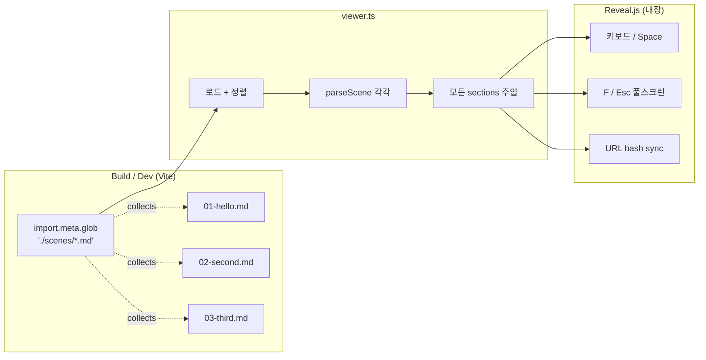

# spec-01-03: 다중 scene 네비게이션 (디렉토리 자동 발견 + 키보드 / 풀스크린)

## 📋 메타

| 항목 | 값 |
|---|---|
| **Spec ID** | `spec-01-03` |
| **Phase** | `phase-01` |
| **Branch** | `spec-01-03-multi-scene-navigation` |
| **상태** | Planning |
| **타입** | Feature |
| **Integration Test Required** | no (Phase 시나리오 2 의 *부분* 을 Playwright 헤드리스로 검증 — 애니/fragment 는 spec-01-04) |
| **작성일** | 2026-05-10 |
| **소유자** | dennis |

## 📋 배경 및 문제 정의

### 현재 상황

`spec-01-01-bootstrap-viewer` (PR #2) + `spec-01-02-restructure-after-bootstrap` (PR #3) 머지 후:
- `studio/src/viewer.ts` 가 **단일 scene** (`hello.md`) 만 fetch + 파싱 + Reveal init.
- Reveal 자체는 이미 키보드 (←/→/Space) / 풀스크린 (F/Esc) / URL hash 동기화를 *내장* 으로 제공.
- 하지만 *다중 scene* 이 viewer 에 들어와야 Reveal 의 네비가 의미를 가짐.

### 문제점

1. **단일 scene 만 보여줌**: scene 1장만 떠 있어 "다중 scene 네비게이션" 검증 불가.
2. **scene 나열 메커니즘 부재**: 새 scene 추가 시 어떻게 viewer 에 노출할지 합의 없음.
3. **Phase 시나리오 2 (다중 scene 네비) 미달**: phase-01.md 의 통합 테스트 시나리오 2 가 본 spec 의 책임 영역.

### 해결 방안 (요약)

본 spec 한 PR 에서 다음을 처리:

1. **scene 디렉토리 자동 발견** — Vite 의 `import.meta.glob` 으로 빌드 / dev 모두 동일하게 scene 파일을 자동 수집. 사용자는 파일만 추가하면 됨 (manifest 불필요).
2. **scene 파일 위치 이동** — `studio/public/scenes/` → `studio/src/scenes/` (Vite 표준 모듈 import 지원).
3. **다중 section 주입** — viewer 가 모든 scene 을 정렬해 `<section>` 들을 한 번에 주입.
4. **scene 정렬 컨벤션** — 파일명 prefix (`01-`, `02-`, `99-`) 알파벳 정렬.
5. **Reveal 내장 동작 자동 검증** — 키보드 (←/→/Space), 풀스크린 (F/Esc), URL hash 동기화, 끝 scene 에서 → 정지 — Playwright 로 자동 확인.
6. **샘플 scene 추가** — 기존 `hello.md` 외에 2~3장 더 (`02-...`, `03-...`) 추가해 다중 scene 시연.

## 📊 개념도

## 🎯 요구사항

### Functional Requirements

1. **scene 디렉토리 이동**: `studio/public/scenes/hello.md` → `studio/src/scenes/01-hello.md` (정렬 prefix 적용).
2. **자동 수집 메커니즘**: `viewer.ts` 가 `import.meta.glob('./scenes/*.md', { query: '?raw', import: 'default', eager: true })` 로 모든 scene 파일의 raw 텍스트를 수집.
3. **정렬 정책**: 키 (파일 경로) 알파벳 정렬. prefix 컨벤션 (`NN-{slug}.md`) 권장.
4. **다중 section 주입**: viewer 가 각 scene 을 `parseScene` 호출 → 모든 `sections[]` 를 평탄화 (flatten) → `#slides` 에 주입.
5. **scene 파일 ≥3장**: `01-hello.md` (기존, 이름 변경), `02-{슬러그}.md`, `03-{슬러그}.md` 추가.
6. **Reveal 내장 동작 보존 + 자동 검증**:
   - 키보드 →/← 로 scene 1 → 2 → 3 진행
   - F 로 풀스크린 toggle (Reveal 의 default 동작)
   - URL hash (`#/1`, `#/2`) 가 scene 진행에 따라 갱신 + 새로고침 시 같은 scene 으로 돌아옴
   - 마지막 scene 에서 → 더 누르면 멈춤 (Reveal default `loop: false`)
7. **단위 테스트 (Vitest)**: viewer 의 *정렬 / 평탄화* 로직을 별 순수 함수로 추출 (`src/scenes/loader.ts` 같은 위치) → 단위 테스트 (정렬 / 평탄화 / scene 메타 추출 케이스 ≥2).
8. **Playwright 헤드리스 자동 검증** (이전 spec 과 동일 일회성 패턴):
   - 시나리오: 시작 → → 키 2회 → 마지막 scene → URL hash 가 마지막 index 로 갱신 → → 한 번 더 눌러도 hash 변화 없음 (정지 확인)
   - 추가 체크: F 키 풀스크린 진입 시도 — DOM `document.fullscreenElement` 또는 Reveal 의 `Reveal.isOverview()` 등으로 가능한 만큼 확인. headless chromium 의 fullscreen 한계로 *완전 풀스크린* 은 안 되면 walkthrough 노트.
   - 새 스크린샷: scene 1 (`01-`) / scene 2 (`02-`) 각각 캡처.

### Non-Functional Requirements

1. **Reveal 종속 격리 유지**: ADR-002 의 정책 — Reveal API 호출은 `viewer.ts` 1 곳에만. parser 는 변경 없음.
2. **scene 추가 비용 최소**: scene 파일 1장 추가 만으로 viewer 에 자동 노출 (코드 / config 수정 불필요).
3. **build / test / dev 명령 변경 없음**: `cd studio && pnpm run dev` / `pnpm run build` / `pnpm run test` 그대로.
4. **산출 문서 한국어** (constitution §5.4).
5. **의존성 추가 0**: `import.meta.glob` 은 Vite 내장. 새 라이브러리 도입 없음.

## 🚫 Out of Scope

- **CSS 애니메이션 / 전환 효과** — `spec-01-04`.
- **Fragment 등장** — `spec-01-04`.
- **PDF 출력** — `spec-01-05`.
- **scene frontmatter 의 `transition` / `order` 키** — `transition` 은 spec-01-04, `order` 는 본 spec 에서 *선택* 으로만 (파일명 prefix 가 1차).
- **Markdown 파서 고도화** — `spec-01-06` (선택).
- **scene 별 hot reload / live preview** — Vite 기본 HMR 으로 충분.
- **Touch / 스와이프 제스처** — Reveal 내장 그대로.
- **scene 별 컨트롤 (다음 scene 미리보기 등)** — 후속 phase.

## 🔍 Critique 결과

미실행. 본 spec 은 *Reveal 내장 + Vite 표준 패턴* 의 결합이라 결정 폭이 좁음. critique 가치 제한적.

## ✅ Definition of Done

- [ ] **scene 파일 ≥3장** (`01-hello.md`, `02-...`, `03-...`) `studio/src/scenes/` 안에 존재
- [ ] **viewer.ts** 가 `import.meta.glob` 으로 자동 수집 + 정렬 + 평탄화 + Reveal init
- [ ] **`src/scenes/loader.ts`** (또는 동등) — 정렬 / 평탄화 로직이 viewer 와 분리되어 단위 테스트 가능
- [ ] **단위 테스트** PASS (loader 케이스 ≥2 추가, 기존 parser 케이스 유지)
- [ ] **Playwright 자동 검증** PASS — 다중 scene 네비 + URL hash 갱신 + 마지막 scene 정지
- [ ] **새 스크린샷 2장** (scene 1 / scene 2) `specs/spec-01-03-multi-scene-navigation/`
- [ ] **풀스크린 검증** 시도 — headless 한계로 안 되면 walkthrough 에 사유 기록
- [ ] **walkthrough.md / pr_description.md** ship commit
- [ ] **`spec-01-03-multi-scene-navigation`** 브랜치 push + PR 생성
- [ ] 사용자 검토 요청 알림
