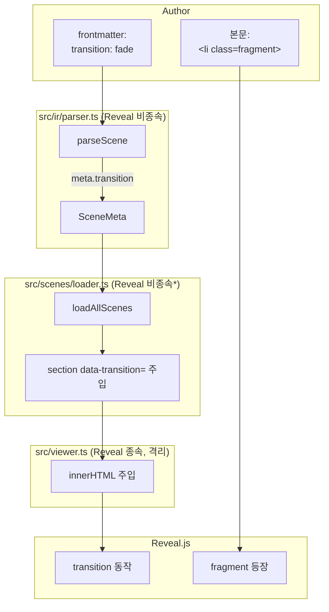

# Implementation Plan: spec-01-04

## 📋 Branch Strategy

- 신규 브랜치: `spec-01-04-animations-and-fragments`
- 시작 지점: `main` (PR #4 머지 직후)
- 첫 task 가 브랜치 생성

## 🛑 사용자 검토 필요 (User Review Required)

> [!IMPORTANT]
> - [ ] **Fragment 컨벤션 = `<li class="fragment">`** (HTML class 직접) — 사용자 합의
> - [ ] **Transition 메타 = frontmatter `transition: fade|slide|zoom|...`** (Reveal 표준) — 사용자 합의
> - [ ] **Reveal 표준 명 사용** — phase-01.md 의 `slide-up` 추정명을 `slide` 로 정정
> - [ ] **`data-transition` 주입 위치 = `loader.ts`** (Reveal 비종속 영역, 문자열 처리). ADR-002 격리 정책 *부분 위반* (키 이름이 Reveal 컨벤션). walkthrough 에 *근사 격리* 로 기록.
> - [ ] **PDF 호환 CSS 1줄 사전** — `@media print` 에서 fragment 보이도록. spec-01-05 의 출발점.

> [!WARNING]
> - [ ] **fragment 가 이전 scene 에 영향 없음 보장** — 본 spec 작업 중 scene 1/2 가 의도치 않게 fragment 동작에 영향 받지 않는지 회귀 확인.

## 🎯 핵심 전략 (Core Strategy)

### 아키텍처 컨텍스트



\* loader 의 `data-transition` 키 이름이 Reveal 컨벤션이라 *근사 격리*. 이주 시 영향은 viewer.ts + loader.ts 두 곳 (parser 는 안전).

### 주요 결정

| 컴포넌트 | 결정 | 이유 |
|:---:|:---|:---|
| **transition 매핑** | Reveal 표준 (`fade/slide/zoom/convex/concave/none`) 그대로 | 변환 layer 불필요. phase-01.md 의 `slide-up` 추정 → `slide` 정정. |
| **fragment 컨벤션** | `<li class="fragment">` 직접 (HTML class) | Reveal 표준. parser/loader 변경 0. MD inline HTML 친화. |
| **`data-transition` 주입 위치** | `loader.ts` | Reveal API 미호출 = 격리. 단 키 이름은 Reveal — 부분 위반 인지. |
| **단위 테스트 분포** | parser +2 (transition 추출 / 무효값 무시), loader +2 (속성 있음/없음) | 두 모듈 책임이 분리되어 각각 커버 |
| **샘플 scene 변경 범위** | 3장 모두 transition 명시 + scene 3 에 fragment 3개 | 전환 차이 + fragment 등장 둘 다 시각 검증 가능 |
| **PDF 호환 CSS 위치** | `studio/src/index.html` 의 `<style>` 인라인 (간단) | 별 CSS 파일은 spec-01-05 에서 본격 분리 |
| **Playwright 시나리오** | A (transition 속성) + B (fragment 등장 시퀀스) | A 는 정적 DOM, B 는 동적 인터랙션 |

## 📂 Proposed Changes

### Task 1 — 브랜치 + parser 확장 (TDD)

#### [MODIFY] `studio/test/ir.parser.test.ts`
- 케이스 4: `transition: zoom` frontmatter → `meta.transition === 'zoom'`
- 케이스 5: `transition: invalid-value` → `meta.transition === undefined`

#### [MODIFY] `studio/src/ir/parser.ts`
- `Transition` 유니온 타입 + `SceneMeta.transition` 추가
- frontmatter 파싱 루프에서 `transition` 키 처리 + 화이트리스트 검증

### Task 2 — loader.ts 확장 (TDD)

#### [MODIFY] `studio/test/scenes.loader.test.ts`
- 케이스 5: `transition: fade` 가 frontmatter 에 있으면 `sections[0]` 에 `<section data-transition="fade">` 시작
- 케이스 6: `transition` 없으면 `<section>` 그대로 (속성 없음)

#### [MODIFY] `studio/src/scenes/loader.ts`
```ts
function withTransition(section: string, transition: Transition | undefined): string {
  if (!transition) return section;
  return section.replace(/^<section>/, `<section data-transition="${transition}">`);
}
// loadAllScenes 안에서 sections.map((s, i) => withTransition(s, scenes[i].meta.transition))
```

### Task 3 — viewer / index.html (PDF 호환 CSS)

#### [MODIFY] `studio/src/index.html`
- `<style>@media print { .fragment { opacity: 1 !important; visibility: visible !important; } }</style>` 추가
- (또는 별 CSS 파일 — 단순함을 위해 인라인)

#### [MODIFY] `studio/src/viewer.ts`
- 변경 없음 (loader 가 transition 처리, fragment 는 Reveal 자동) — 단 회귀 테스트 위해 dev 실행 + Playwright 검증.

### Task 4 — 샘플 scene 갱신

#### [MODIFY] `studio/src/scenes/01-hello.md`
- frontmatter 에 `transition: zoom` 추가

#### [MODIFY] `studio/src/scenes/02-layered-model.md`
- `transition: slide` 추가

#### [MODIFY] `studio/src/scenes/03-event-log.md`
- `transition: fade` 추가
- 본문 끝에 fragment 3개:
  ```html
  <ul style="list-style:none;padding:0;margin-top:1.5rem;text-align:left">
    <li class="fragment">자막 자동 sync</li>
    <li class="fragment">scene 부분 재렌더링</li>
    <li class="fragment">챕터 자동 생성</li>
  </ul>
  ```

### Task 5 — Playwright 자동 검증

#### [NEW (임시)] `studio/.verify-anim-frag.mjs`

체크 항목 (≥10):
1. 시작 시 console errors 0
2. scene 1 의 `section.present` 의 `data-transition` = `zoom`
3. → 1회 → scene 2 도달
4. scene 2 의 `data-transition` = `slide`
5. → 1회 더 → scene 3 도달
6. scene 3 의 `data-transition` = `fade`
7. scene 3 의 `.fragment` 요소 3개 존재 (`document.querySelectorAll('section.present .fragment').length`)
8. 초기 `.fragment.visible` 0개
9. → 1회 → `.fragment.visible` 1개
10. → 2회 → 2개
11. → 3회 → 3개
12. → 한 번 더 → fragment 모두 보임 유지 + 다음 scene 없음 (마지막)
- 스크린샷: fragment 모두 등장 상태.

검증 후 스크립트 삭제 (이전 spec 패턴).

#### [NEW] `specs/spec-01-04-animations-and-fragments/screenshot-fragments-all.png`

### Task 6 — README / docs/planning (선택)

- 디렉토리 트리 변화 없음 → README 갱신 거의 없음
- `docs/planning.md` Phase 1 산출물에 "transition / fragment 컨벤션" 한 줄 추가 (선택)

## 🧪 검증 계획 (Verification Plan)

### 단위 테스트

```bash
cd studio && pnpm run test
```

기대:
- parser: 3 (회귀) + 2 (신규) = **5 케이스**
- loader: 4 (회귀) + 2 (신규) = **6 케이스**
- 총 **11 케이스 PASS**

### 통합 테스트

해당 없음 (Integration Test Required = no).

### 수동 검증 시나리오

1. **transition 속성**: scene 1 → scene 2 전환 시 화면 모션 차이 (zoom → slide). dev 서버 + 사람 눈으로도 확인 가능.
2. **fragment 등장**: scene 3 도달 → → 키 누를 때마다 fragment 한 개씩 페이드인.
3. **PDF 호환**: 본 spec 에서 *깊은* PDF 검증 안 함 (spec-01-05). 단 `@media print` 규칙이 viewer 의 dev 동작에 영향 없는지 회귀 확인.
4. **build 크기**: 이전 207 kB → 현재 ≤209 kB 인지 확인.

## 🔁 Rollback Plan

- `git revert <merge commit>` 으로 즉시 원복.
- 의존성 추가 0 → 영향 격리.

## 📦 Deliverables 체크

- [ ] task.md 작성 (다음 단계)
- [ ] 사용자 Plan Accept
- [ ] (실행 후) parser/loader 확장 + 테스트 11/11 PASS
- [ ] (실행 후) scene 갱신 + Playwright 시나리오 A/B PASS
- [ ] (실행 후) 새 스크린샷 + walkthrough/pr_description ship + push + PR
