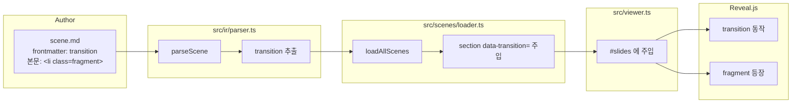

# spec-01-04: scene 전환 애니메이션 + Fragment 등장

## 📋 메타

| 항목 | 값 |
|---|---|
| **Spec ID** | `spec-01-04` |
| **Phase** | `phase-01` |
| **Branch** | `spec-01-04-animations-and-fragments` |
| **상태** | Planning |
| **타입** | Feature |
| **Integration Test Required** | no (Phase 시나리오 2 의 *애니/fragment* 부분을 Playwright 로 검증) |
| **작성일** | 2026-05-10 |
| **소유자** | dennis |

## 📋 배경 및 문제 정의

### 현재 상황

- spec-01-03 완료 후: 다중 scene 표시 + 키보드 / 풀스크린 / URL hash 모두 동작.
- Reveal 의 *기본 transition* (default = slide) 만 적용 — scene 간 차별화 없음.
- Reveal 의 *fragment* 동작은 내장이지만 scene 작성 시 *어떻게 표시할지* 컨벤션 미정.

### 문제점

1. **scene 별 전환 효과 없음** — 모든 scene 이 동일 default transition. Phase-01.md 시나리오 2 의 "각 scene 전환 시 애니메이션이 동작" 미달.
2. **fragment 컨벤션 부재** — 사용자가 어떻게 fragment 를 작성할지 합의 없음. Phase-01.md 시나리오 2 의 "fragment 가 한 번 누를 때마다 하나씩 등장" 미달.
3. **PDF 호환 사전 고려 필요** — fragment 의 *최종 상태* 가 PDF 출력에 보여야 함 (spec-01-05 와 연계). 본 spec 에서 *적어도 막지는 않게* 해야.

### 해결 방안 (요약)

본 spec 한 PR 에서 다음을 처리:

1. **frontmatter `transition` 키** 도입 — `fade / slide / zoom / convex / concave / none` (Reveal 표준).
2. **`parser.ts` 확장** — `SceneMeta.transition` 추출. 단위 테스트 케이스 추가.
3. **`loader.ts` 통합** — `<section>` 시작 태그에 `data-transition` 속성 주입 (Reveal 비종속 영역, 문자열 처리).
4. **fragment 컨벤션** — `<li class="fragment">` 직접 (Reveal 표준). MD 안 inline HTML 로 사용. parser / loader 변경 0.
5. **샘플 scene 갱신** — 기존 3장에 transition 메타 + scene 3 에 fragment 3개.
6. **자동 검증** — Playwright 헤드리스로 transition 적용 + fragment 등장 시퀀스.
7. **PDF 호환 사전 CSS** — fragment 최종 상태가 print 에서 보이도록 1~2줄 (spec-01-05 출발점).

## 📊 개념도



## 🎯 요구사항

### Functional Requirements

1. **`SceneMeta` 타입 확장** (`studio/src/ir/parser.ts`):
   ```ts
   export type Transition = 'none' | 'fade' | 'slide' | 'convex' | 'concave' | 'zoom';
   export interface SceneMeta {
     title?: string;
     transition?: Transition;
   }
   ```
2. **`parseScene` 의 frontmatter 파서 확장** — `transition` 키 추출. 위 6개 값 외에는 무시 (`undefined` 유지).
3. **단위 테스트 (parser) 케이스 추가**:
   - `transition: zoom` 추출
   - `transition: invalid-value` 무시
4. **`loader.ts` 가 `data-transition` 주입** — `<section>` 시작 태그 → `<section data-transition="${meta.transition}">`. `transition === undefined` 면 속성 안 붙임.
5. **단위 테스트 (loader) 케이스 추가**:
   - frontmatter `transition: fade` 가 있는 scene → sections[0] 에 `data-transition="fade"` 포함
   - `transition` 없는 scene → `data-transition` 속성 없음 (Reveal default 사용)
6. **Fragment 컨벤션 = HTML class 직접**: 작성 예 `<li class="fragment">항목</li>`. parser / loader 변경 0 — HTML 그대로 통과.
7. **샘플 scene 갱신**:
   - `01-hello.md`: frontmatter 에 `transition: zoom` 추가
   - `02-layered-model.md`: `transition: slide`
   - `03-event-log.md`: `transition: fade` + 본문 끝에 fragment 3개 (`<ul>` 안 `<li class="fragment">`)
8. **PDF 호환 사전 CSS** — `studio/src/index.html` 의 `<style>` 또는 별 CSS 파일에:
   ```css
   @media print {
     .fragment { opacity: 1 !important; visibility: visible !important; }
   }
   ```
   spec-01-05 의 본격 PDF 작업이 본 CSS 위에서 시작.
9. **Playwright 헤드리스 자동 검증**:
   - **시나리오 A (transition 속성)**: scene 1 의 section 이 `data-transition="zoom"`, scene 2 가 `slide`, scene 3 가 `fade` 인지 DOM 에서 확인.
   - **시나리오 B (fragment 등장)**:
     - scene 3 (`#/2`) 으로 직접 이동 (URL hash 또는 → 키 2회)
     - 초기: 모든 `.fragment` 가 *숨김* (`.visible` 클래스 없음)
     - → 키 1회 → 첫 `.fragment.visible`
     - → 키 2회 → 둘째도 `.visible`
     - → 키 3회 → 셋째까지 모두 `.visible`
     - 마지막에서 → 키 더 → 변화 없음 (마지막 scene 의 마지막 fragment)
   - 새 스크린샷: scene 3 fragment 모두 등장 상태.

### Non-Functional Requirements

1. **Reveal 격리 정책 (ADR-002)** — Reveal API 호출은 viewer.ts 1 곳. loader 의 `data-transition` 주입은 *문자열 처리* 지만 키 이름 (`data-transition`) 은 Reveal 컨벤션 — 격리 *완벽* 은 아님 (부분 위반). walkthrough 에 *근사 격리* 로 기록 + 향후 (d) 플러그인 이주 시 영향 limited.
2. **parser 변경 최소** — `transition` 키 추가 외 기존 동작 변경 없음 (회귀 테스트 통과).
3. **번들 크기 영향 ≤2 kB**.
4. **산출 문서 한국어**.
5. **의존성 추가 0**.

## 🚫 Out of Scope

- **PDF 출력 본격 작업** — `spec-01-05`.
- **Custom 애니메이션 (`@keyframes` 직접)** — Reveal 표준 transition 만.
- **Fragment 세밀 제어** (`data-fragment-index` 명시 순서, `fade-in/out/highlight-blue` 등) — 후속 phase.
- **`data-transition-speed`** — Reveal default 만.
- **Markdown 파서 고도화** — `spec-01-06`.
- **테마 변경** — `black` 그대로.

## 🔍 Critique 결과

미실행. Reveal 표준 + 명확한 컨벤션 결정이라 critique 가치 제한적.

## ✅ Definition of Done

- [ ] `SceneMeta.transition` 타입 + parser 추출 + 단위 테스트 케이스 ≥2
- [ ] `loader.ts` 가 `data-transition` 주입 + 단위 테스트 케이스 ≥1 (있음/없음 둘 다)
- [ ] scene 3장 모두 frontmatter `transition` 명시 + scene 3 에 fragment 3개
- [ ] PDF 호환 CSS (`@media print` fragment 보임) 추가
- [ ] Playwright 시나리오 A (transition 속성) PASS
- [ ] Playwright 시나리오 B (fragment 클릭마다 등장) PASS
- [ ] 새 스크린샷 (fragment 모두 등장 상태) `specs/spec-01-04-animations-and-fragments/screenshot-fragments-all.png`
- [ ] `pnpm run build` PASS, `pnpm run test` PASS (parser + loader 늘어난 만큼)
- [ ] walkthrough.md / pr_description.md ship commit
- [ ] 브랜치 push + PR 생성
- [ ] 사용자 검토 요청 알림
