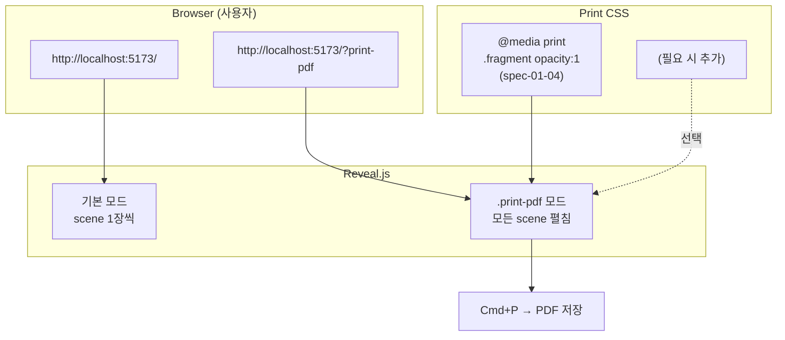

# Implementation Plan: spec-01-05

## 📋 Branch Strategy

- 신규 브랜치: `spec-01-05-pdf-print-output`
- 시작 지점: `main` (PR #5 머지 직후)
- 첫 task 가 브랜치 생성

## 🛑 사용자 검토 필요 (User Review Required)

> [!IMPORTANT]
> - [ ] **PDF 생성 = 사용자 수동 (`?print-pdf` URL + Cmd+P)** — 사용자 합의
> - [ ] **자동화 CLI (`pnpm run pdf`) 도입 안 함** — 사용자 합의 (Out of Scope)
> - [ ] **Playwright 자동 검증만 일회성 + PDF 페이지별 PNG 3장 commit** (PDF 본체 X)
> - [ ] **viewer.ts 변경 가능하면 안 함** — Reveal `?print-pdf` 자체 처리

> [!WARNING]
> - [ ] **PDF 회귀 위험**: spec-01-04 사전 CSS (`.fragment`) 외에 transition / inline HTML / JSONL 코드 블록이 print 에서 깨질 가능성 — 검증 단계에서 발견 시 CSS 보강 필요.
> - [ ] **headless chromium 의 `.print-pdf` body 클래스 인식 시점**: Reveal 가 비동기로 추가 — `waitForFunction` 으로 명시 wait.

## 🎯 핵심 전략 (Core Strategy)

### 아키텍처 컨텍스트



### 주요 결정

| 컴포넌트 | 결정 | 이유 |
|:---:|:---|:---|
| **PDF 생성 메커니즘** | Reveal `?print-pdf` URL 모드 그대로 | Reveal 내장. 의존성 0. 사용자 1 step. |
| **자동 검증 도구** | Playwright `page.pdf()` 일회성 | 실제 PDF 생성 + 페이지 수 검증. devDep 추가 0. |
| **시각 증거** | 페이지별 PNG 3장 (PDF 본체 X) | git binary 가벼움. GitHub UI 에서 바로 보임. |
| **viewer.ts 변경** | 가능하면 0 | Reveal 가 자체 처리. ADR-002 격리 정책 유지. |
| **추가 CSS 보강** | 회귀 발견 시에만 | YAGNI — 우선 검증, 깨지면 그때 보강. |
| **README 가이드** | "PDF 출력" 섹션 1 단락 | 사용자 진입점에서 즉시 발견 가능. |

## 📂 Proposed Changes

### Task 1 — 브랜치 + scaffolds

#### [NEW] `specs/spec-01-05-pdf-print-output/{spec,plan,task}.md`
- pre-flight 산출물 add.

### Task 2 — Playwright 자동 검증 (필요 시 CSS 보강)

#### [NEW (임시)] `studio/.verify-pdf.mjs`

검증 단계:
1. **시나리오 A**: `?print-pdf` URL 접속 + body 에 `.print-pdf` 클래스 (waitForFunction) + console 에러 0.
2. **시나리오 B**: `await page.pdf({ format: 'A4', landscape: true })` 로 PDF buffer 생성 + 페이지 수 검증 (PDF 헤더 파싱 또는 Reveal 의 pdf-page 클래스 카운트).
3. **시나리오 C**: scene 별 페이지 캡처 — `?print-pdf` 모드에서 각 scene 의 DOM 영역 스크롤 후 스크린샷.
   - 또는 더 간단: `?print-pdf` 모드의 *전체 페이지 스크린샷* 후 page break 별로 분할 (실용적).
   - 가장 단순: scene 별 wrapper 의 `boundingBox` 로 영역 캡처.

검증 후 스크립트 삭제.

#### [MODIFY] `studio/src/index.html` (필요 시)
- 검증 결과 PDF 가 깨지면 추가 CSS 보강 (예: `@media print { pre, code { white-space: pre-wrap; } }` 등).
- 깔끔하면 변경 없음.

### Task 3 — README 가이드

#### [MODIFY] `README.md`
- 새 섹션:
  ```
  ## PDF 출력
  scene 들을 한 PDF 로 뽑으려면:
  1. `cd studio && pnpm run dev`
  2. 브라우저에서 `http://localhost:5173/?print-pdf` (또는 dev 가 fallback 한 포트) 열기
  3. `Cmd+P` (Mac) 또는 `Ctrl+P` (Win/Linux) → "PDF 로 저장"
  ```

### Task 4 — Ship

walkthrough / pr_description / ship commit / push / PR.

## 🧪 검증 계획 (Verification Plan)

### 단위 테스트

해당 없음 (parser/loader 변경 없음). 회귀로 기존 11 케이스 PASS 만 확인.

```bash
cd studio && pnpm run test   # 11/11 회귀
cd studio && pnpm run build  # tsc + vite build PASS
```

### 통합 테스트 (Integration Test Required = yes)

Playwright 헤드리스 시나리오 A/B/C — 위 Task 2 의 검증 스크립트.

### 수동 검증 시나리오

1. **사람이 직접 PDF 뽑기**: README 가이드대로 → 실제로 PDF 가 떨어지는지 사용자 검증 (옵션 — 자동 검증으로 대부분 갈음).
2. **PDF 페이지 수**: 자동 ≥3.
3. **Fragment 최종 상태**: 자동 — scene 3 의 page 에 fragment 3개 보임.
4. **한글 / inline HTML / 코드 블록**: 자동 페이지 캡처에서 시각 확인.

## 🔁 Rollback Plan

- viewer.ts 변경 없음 가정. CSS 보강 시에도 1~2 줄.
- `git revert <merge commit>` 으로 즉시 원복.

## 📦 Deliverables 체크

- [ ] task.md 작성 (다음 단계)
- [ ] 사용자 Plan Accept
- [ ] (실행 후) Playwright 시나리오 A/B/C PASS + PNG 3장
- [ ] (필요 시) CSS 보강
- [ ] README "PDF 출력" 섹션
- [ ] walkthrough/pr_description ship + push + PR
