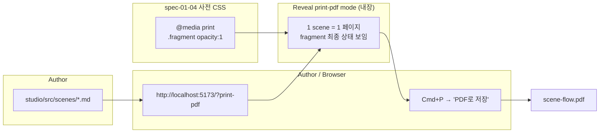

# spec-01-05: PDF 출력 (`@media print` + Reveal print-pdf 모드)

## 📋 메타

| 항목 | 값 |
|---|---|
| **Spec ID** | `spec-01-05` |
| **Phase** | `phase-01` |
| **Branch** | `spec-01-05-pdf-print-output` |
| **상태** | Planning |
| **타입** | Feature |
| **Integration Test Required** | yes (Phase 시나리오 3 의 *PDF 출력* 자동 검증) |
| **작성일** | 2026-05-10 |
| **소유자** | dennis |

## 📋 배경 및 문제 정의

### 현재 상황

- spec-01-04 까지: 다중 scene + transition + fragment 동작.
- Reveal.js 자체에 **`?print-pdf` URL 모드** 내장 — 쿼리스트링 붙이면 print-friendly layout 자동 적용 (각 scene 1 페이지).
- spec-01-04 에서 `studio/src/index.html` 에 `@media print { .fragment { opacity:1; visibility:visible; } }` 사전 CSS 1줄 깔아둠 (PDF 에 fragment 최종 상태 보이도록).

### 문제점

1. **Phase 시나리오 3 미달** — phase-01.md 의 "scene 3장이 각각 1페이지로 떨어지고, 모든 fragment 의 *최종 상태* 가 PDF 에 포함" 자동 / 수동 검증 모두 없음.
2. **`?print-pdf` 모드 동작 미확인** — Reveal 의 내장 모드가 우리 viewer + IR + transition 와 잘 통합되는지 검증 필요.
3. **사용자 가이드 부재** — 어떤 절차로 PDF 를 뽑는지 README 또는 docs 에 명시되지 않음.

### 해결 방안 (요약)

본 spec 한 PR 에서:

1. **Reveal `?print-pdf` 모드 검증** — viewer URL 에 `?print-pdf` 붙여 정상 로드, console 에러 0, body 에 `.print-pdf` 클래스, 모든 scene 이 페이지 단위로 펼쳐짐.
2. **PDF 호환 추가 CSS** (필요 시) — fragment 외에 transition 이나 inline HTML 이 PDF 에서 깨지는 회귀 점검 + 수정.
3. **자동 검증** — Playwright `page.pdf()` 로 실제 PDF 생성 → 페이지 수 = scene 수 (3) + fragment 보임 검증.
4. **페이지별 PNG 스크린샷 3장** commit (시각 증거).
5. **README 가이드** — *PDF 로 뽑는 절차* (수동: `?print-pdf` → Cmd+P → "PDF 로 저장") 한 단락.
6. **(자동화 도입 안 함)** — 사용자 결정으로 `pnpm run pdf` 같은 CLI 는 도입 안 함. 자동 검증만 일회성.

## 📊 개념도



## 🎯 요구사항

### Functional Requirements

1. **`?print-pdf` 모드 동작 보장**:
   - viewer 가 `?print-pdf` 쿼리스트링과 함께 로드되면 Reveal 가 자동으로 print-friendly 모드로 전환.
   - body 에 `.print-pdf` 클래스가 붙음.
   - console 에러 0.
   - 모든 scene 이 *각자의 페이지* 로 펼쳐져 보임.
2. **PDF 회귀 점검 / 추가 CSS** — 다음이 PDF 에 *깨지지 않게*:
   - inline HTML grid (scene 1, 2 의 `display:grid`)
   - 한국어 텍스트
   - JSONL `<pre><code>` 코드 블록 (scene 3)
   - `.fragment` 의 최종 상태 (이미 spec-01-04 처리됨, 회귀 보호)
   - 필요 시 `studio/src/index.html` 의 `<style>` 또는 별 CSS 보강.
3. **Playwright 자동 검증** (일회성 패턴 — `pnpm add -D playwright` + 검증 후 remove):
   - **시나리오 A — print-pdf 모드 로드**: `?print-pdf` URL 접속 → body 에 `.print-pdf` 클래스 + console 에러 0.
   - **시나리오 B — PDF 페이지 수 = scene 수**: `page.pdf({ format: 'A4', landscape: true })` 로 실제 PDF 생성 → PDF 페이지 수 ≥ 3.
   - **시나리오 C — PDF 시각 캡처**: 각 scene 이 화면에 펼쳐진 상태에서 페이지별 스크린샷 3장.
4. **시각 증거 commit**:
   - `specs/spec-01-05-pdf-print-output/screenshot-pdf-page-{1,2,3}.png`
   - PDF 본체 (`.pdf`) 는 commit 안 함.
5. **README 사용자 가이드**:
   - "PDF 출력" 섹션 1 단락 추가:
     ```
     ## PDF 출력
     1. cd studio && pnpm run dev
     2. http://localhost:5173/?print-pdf
     3. 브라우저에서 Cmd+P (또는 Ctrl+P) → "PDF 로 저장"
     ```

### Non-Functional Requirements

1. **의존성 추가 0** — Playwright 는 일회성.
2. **viewer 코드 변경 최소** — Reveal 가 `?print-pdf` 자체 처리. viewer.ts 는 *변경 없음* 이 이상적.
3. **Reveal 격리 정책 유지** — `?print-pdf` 트리거는 Reveal 내장, viewer.ts 영향 없음.
4. **산출 문서 한국어**.

## 🚫 Out of Scope

- **`pnpm run pdf` 같은 CLI 자동화** — 사용자 결정. 미래 spec 또는 phase-3.
- **Custom 페이지 크기 / 여백 조정** — Reveal 기본.
- **PDF 메타데이터 (제목, 저자)**.
- **여러 export target 통합** — Phase-3 Composition.
- **PDF 클릭 가능한 내부 링크 / TOC**.
- **decktape / puppeteer 외부 도구**.

## 🔍 Critique 결과

미실행.

## ✅ Definition of Done

- [ ] `?print-pdf` 모드 자동 검증 (시나리오 A/B/C) PASS
- [ ] 페이지별 스크린샷 3장 commit
- [ ] (필요 시) PDF 호환 CSS 보강
- [ ] README "PDF 출력" 섹션 추가
- [ ] `pnpm run build` PASS, `pnpm run test` PASS (회귀 11/11)
- [ ] walkthrough.md / pr_description.md ship commit
- [ ] 브랜치 push + PR 생성
- [ ] 사용자 검토 요청 알림
