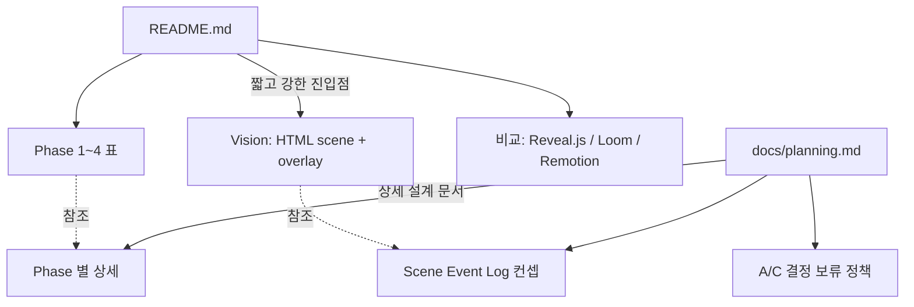

# Implementation Plan: spec-x-rebrand-vision

## 📋 Branch Strategy

- 신규 브랜치: `spec-x-rebrand-vision` (브랜치 이름 = spec 디렉토리 이름, `feature/` prefix 없음)
- 시작 지점: `main`
- 첫 task 가 브랜치 생성을 수행함

## 🛑 사용자 검토 필요 (User Review Required)

> 본 Plan 을 Accept 하기 전에 사용자가 명시적으로 확인해야 할 항목들.

> [!IMPORTANT]
> - [ ] **이름 확정**: `scene-flow` (사용자 합의 완료)
> - [ ] **새 Phase 분할 (1~4)**: Scene Engine → Recording → Composition → AI Automation
> - [ ] **A/C 결정 보류 정책**: Live overlay (A) 부터 시작 + Scene Event Log 를 항상 기록해 Post composition (C) 으로 전환 가능하게 둔다 — 문서에 이 정책을 명시
> - [ ] **Scene Event Log 가 Phase 2 의 핵심 컨셉** 으로 README / planning 양쪽에 등장

> [!WARNING]
> - [ ] **README 가 완전히 갈아엎어짐** — 기존 비교표 / Phase 표 / 디렉토리 구조 모두 제거. git history 로만 추적 가능.
> - [ ] **GitHub repo 이름 변경은 별도 작업** (사용자 책임). 본 SPEC 은 코드베이스 내부만 정리.

## 🎯 핵심 전략 (Core Strategy)

### 아키텍처 컨텍스트

본 SPEC 은 코드 변경이 아닌 *문서 reframe* 작업이다. 따라서 "아키텍처" 는 **문서 구조** 로 정의된다.



- **README** = 30초 진입점. 비전 + Phase 분할 + 비교.
- **planning.md** = 상세. Phase 별 진입조건 / 산출물 / 독립가치 + Scene Event Log + A/C 정책.
- 두 문서 사이에 *중복은 허용*, 모순은 금지.

### 주요 결정

| 컴포넌트 | 전략 | 이유 |
|:---:|:---|:---|
| **이름** | `scene-flow` 로 굳히고 모든 흔적 정리 | "scene" 이 IR (HTML), "flow" 가 pipeline 을 표현 — 비전과 정확히 일치 |
| **README 톤** | "도구" 보다 "엔진 / 파이프라인" 어휘 | 단순 컨버터 인상에서 벗어나기 위함 |
| **PPT export 위치** | "export target 중 하나" 로 강등 | 실제 비전은 layered video pipeline. PPT 는 부수 산출물. |
| **Phase 분할** | Scene Engine / Recording / Composition / AI 의 4-layer | layered overlay 모델과 일치. 각 phase 가 독립 가치를 가짐. |
| **A/C 결정** | A 부터, Event Log 로 C 호환 유지 | 사용자 합의 — "사용해보면서 결정" 정책을 문서로 굳힘 |
| **테스트 정책** | 본 SPEC 은 단위 테스트 면제 | constitution §9.1 — docs only 예외 적용 |
| **`.harness-kit/` 처리** | 손대지 않음 | 외부 키트, 본 프로젝트의 변경 대상이 아님 |

## 📂 Proposed Changes

### 문서

#### [MODIFY] `README.md`

기존 내용을 전체 교체. 새 구조:

```text
1. 제목 + 한 줄 비전
   "scene-flow — HTML 을 base 로 한 layered presentation & video pipeline"

2. 핵심 멘탈 모델
   - HTML scene = base layer (재현 가능, AI 친화)
   - 녹화 / 음성 / 자막 = overlay (사람이 진행, 후처리)
   - 최종 산출물 = base + overlay 의 합성

3. 단계별 가치 (Phase 1~4 표)
   각 phase 가 거기서 멈춰도 의미 있는 산출물을 가짐.

4. 비교표
   Reveal.js / Marp / Slidev / Loom / Remotion 중 어디와 다른가.

5. 현재 상태 / 다음 단계
   "현재 phase-01 (Scene Engine) 설계 단계" 명시.
```

#### [MODIFY] `docs/planning.md`

옛 Phase 1~4 + 디렉토리 구조 + 확장 아이디어를 모두 제거하고 새로 작성:

```text
1. 비전 — HTML scene base + overlay 모델 (긴 설명)
2. Phase 1 — Scene Engine
   · 정의 / 진입 조건 / 산출물 / 독립적 가치
3. Phase 2 — Recording Layer
   · 정의 / Scene Event Log 컨셉 + JSONL 예시
   · A/C 보류 정책
4. Phase 3 — Composition
   · 정의 / ffmpeg pipeline / 자막 sync 전략
5. Phase 4 — AI Automation (선택)
   · script → scene, TTS, 자동 자막
6. 비결정 사항 (Open Questions)
   · A vs C 최종 결정
   · Scene IR 의 형태 (DSL vs HTML vs MDX) — phase-01 에서 결정
   · 렌더 엔진 선택 (Reveal.js / Remotion / 자체)
```

#### [MODIFY] `CLAUDE.md` (필요 시)

현재 `.harness-kit/CLAUDE.fragment.md` 만 import 하고 있어 옛 이름 흔적 없을 가능성 높음. grep 후 발견 시에만 수정.

### 검증 / 정리

#### [GREP] 저장소 전체 (제외: `.harness-kit/`, `.git/`, `.claude/`)

```bash
grep -rn -E "html[-_]?to[-_]?ppt|html2pptx|htmltoppt" \
  --include="*.md" --include="*.json" --include="*.html" \
  --exclude-dir={.harness-kit,.git,.claude} .
```

발견된 모든 위치에 대해 새 이름 또는 새 비전 문구로 치환 / 삭제.

## 🧪 검증 계획 (Verification Plan)

### 단위 테스트

- 본 SPEC 은 docs only — 단위 테스트 면제 (constitution §9.1 예외).

### 통합 테스트

- 해당 없음 (Integration Test Required = no).

### 수동 검증 시나리오

1. **README 30초 테스트** — 첫 화면을 30초만 보고 "scene-flow 가 무엇이고 단계별로 뭘 하는가" 를 설명할 수 있는가? → 가능해야 PASS.
2. **이름 흔적 zero** — 위 grep 명령 결과가 `.harness-kit/` 외부에서 0건이어야 함.
3. **Phase 4-layer 일관성** — README 의 Phase 표와 `docs/planning.md` 의 Phase 정의가 1:1 로 매칭되는가?
4. **Scene Event Log 명문화** — `docs/planning.md` Phase 2 섹션에 JSONL 예시가 들어있고, A/C 보류 정책이 명시되어 있는가?
5. **GitHub 렌더 확인** — Mermaid 다이어그램이 깨지지 않는가 (PR 미리보기로 확인).

## 🔁 Rollback Plan

- 본 SPEC 은 docs 변경만 — `git revert <merge commit>` 으로 즉시 복구 가능.
- 데이터 / 상태 영향 없음.
- 옛 이름 흔적이 외부 (PR / issue / 외부 링크) 에서 발견되면, 별도 spec-x 로 follow-up.

## 📦 Deliverables 체크

- [ ] task.md 작성 (다음 단계)
- [ ] 사용자 Plan Accept 받음
- [ ] (실행 후) 모든 task 완료
- [ ] (실행 후) walkthrough.md / pr_description.md ship
