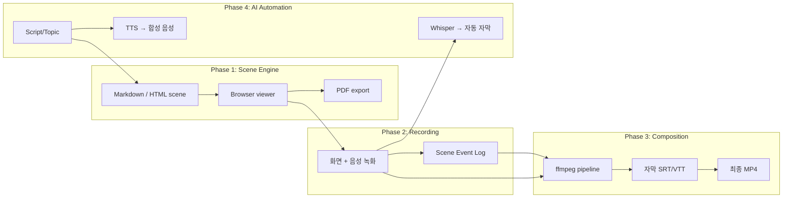

# spec-x-rebrand-vision: 프로젝트 리브랜드 및 비전 재정의

## 📋 메타

| 항목 | 값 |
|---|---|
| **Spec ID** | `spec-x-rebrand-vision` |
| **Phase** | N/A (Solo Spec) |
| **Branch** | `spec-x-rebrand-vision` |
| **상태** | Planning |
| **타입** | Docs (+ Chore) |
| **Integration Test Required** | no |
| **작성일** | 2026-05-10 |
| **소유자** | dennis |

## 📋 배경 및 문제 정의

### 현재 상황

- 프로젝트 이름은 `html-to-ppt`. `README.md` / `docs/planning.md` 가 모두 옛 비전 ("Markdown → 슬라이드 → PDF/영상 컨버터") 기준으로 작성됨.
- `docs/planning.md` 의 Phase 1~4 (기반 → Markdown 파이프라인 → 영상 출력 → 고급 기능) 도 그 비전에 묶여 있음.
- 코드는 아직 없음 (`docs/`, `README.md`, harness-kit 부트스트랩만 존재) — 따라서 리브랜드 비용이 가장 낮은 시점.
- 디렉토리 / Git remote 이름은 이미 `scene-flow` 로 변경되어 있음 (사용자 사전 작업).

### 문제점

1. **이름이 비전을 가둠**: `html-to-ppt` 는 "기능 설명형" 이라 단순 컨버터 / one-shot CLI 처럼 보임. npm 생태계에 같은 류 이름이 다수 존재해 브랜딩이 거의 남지 않음.
2. **PPT 가 주기능처럼 보임**: 실제 비전은 "HTML scene 을 base 로 두고, 그 위에 녹화 / 음성 / 자막을 overlay 해 최종 콘텐츠를 만드는 layered pipeline" 인데, 현재 문서는 PPT export 를 1순위로 그림.
3. **Phase 가 실제 작업 모델과 어긋남**: 현재 Phase 1~4 는 기능 평면 나열인 반면, 실제 단계는 *Scene 준비 → 녹화 → 합성 → AI 자동화* 라는 layered 모델로 떨어짐.
4. **이후 phase 작업의 기준점 부재**: phase-01 (Scene Engine) 이하의 SDD spec 들이 비전 문서를 참조해야 하는데, 그 문서가 옛 프레임을 따르고 있어 기준 역할을 못함.

### 해결 방안 (요약)

이름을 `scene-flow` 로 굳히고, README / planning 을 **layered overlay 모델 + 4-phase 단계화** 로 재작성한다. 본 SPEC 은 *문서 한정* — 코드 / 디렉토리 구조 변경은 Out of Scope.

## 📊 개념도

## 🎯 요구사항

### Functional Requirements

1. **README.md 전면 재작성**
   - 프로젝트명 `scene-flow` 로 변경, 한 줄 비전 문구 갱신
   - 핵심 멘탈 모델 ("HTML scene = base layer, 녹화/음성/자막 = overlay") 명문화
   - Phase 1~4 분할 표 (각 phase 가 독립적으로 가치를 가짐을 명시)
   - 비교표 갱신 (Reveal.js / Loom / Remotion 등 layered 모델 관점)
2. **docs/planning.md 전면 재작성**
   - 옛 Phase 1~4 (기반 / Markdown / 영상 / 고급) 제거 → 새 Phase 1~4 (Scene Engine / Recording / Composition / AI)
   - 각 phase 의 정의 / 진입 조건 / 산출물 / 독립적 가치 (이것만 써도 됨)
   - **Scene Event Log** 컨셉 명문화 — Phase 2 의 핵심 무기. JSONL 예시 포함.
   - **Live overlay (A) vs Post composition (C) 결정 보류** 명시 — 사용 중 결정 정책으로 기록.
   - 옛 디렉토리 구조 (`themes/`, `templates/`, `src/parser.js` …) 제거 — 신규 phase 에서 결정.
3. **이름 흔적 정리 (Chore)**
   - 저장소 전체 grep `html-to-ppt` / `html2pptx` / `htmltoppt` (대소문자 / 하이픈 변형 포함)
   - 발견된 모든 참조를 `scene-flow` 또는 새 비전 문구로 치환 또는 삭제
   - 단, `.harness-kit/` 내부 파일은 외부 키트 (본 프로젝트가 import 하는 것) 라 손대지 않음

### Non-Functional Requirements

1. 모든 산출 문서는 **한국어** (constitution §5.4).
2. 코드 / 외부 리소스 변경 없음 — 본 SPEC 은 docs only.
3. README 는 GitHub 첫 진입 사용자가 30초 안에 "이게 뭐고 단계별로 무엇을 할 수 있는가" 를 이해할 수 있어야 함.

## 🚫 Out of Scope

- 실제 코드 구현 (Phase 1 작업) — 별도 phase 에서.
- 디렉토리 구조 변경 / `package.json` 신설 — Phase 1 의 첫 spec 에서 결정.
- GitHub repository 이름 변경 — 사용자가 별도로 수행 (이미 완료된 것으로 간주).
- 로고 / 색상 / 디자인 자산 — 본 SPEC 범위 밖.
- `.harness-kit/` 내부 파일 수정 — 외부 키트, 본 SPEC 의 변경 대상 아님.
- 새 phase-01.md 작성 — 본 SPEC 다음에 별도 SDD-P 흐름으로 진행.

## 🔍 Critique 결과

미실행. 비전 문서 재작성은 사용자와 충분히 합의된 상태이므로 critique 생략.

## ✅ Definition of Done

- [ ] (단위 테스트 없음 — docs only, constitution §9.1 예외)
- [ ] `walkthrough.md` 와 `pr_description.md` 작성 및 ship commit
- [ ] `spec-x-rebrand-vision` 브랜치 push 완료
- [ ] PR 생성 및 사용자 검토 요청 알림 완료
- [ ] PR merge 후 `sdd specx done rebrand-vision` 으로 queue.md done 이동
